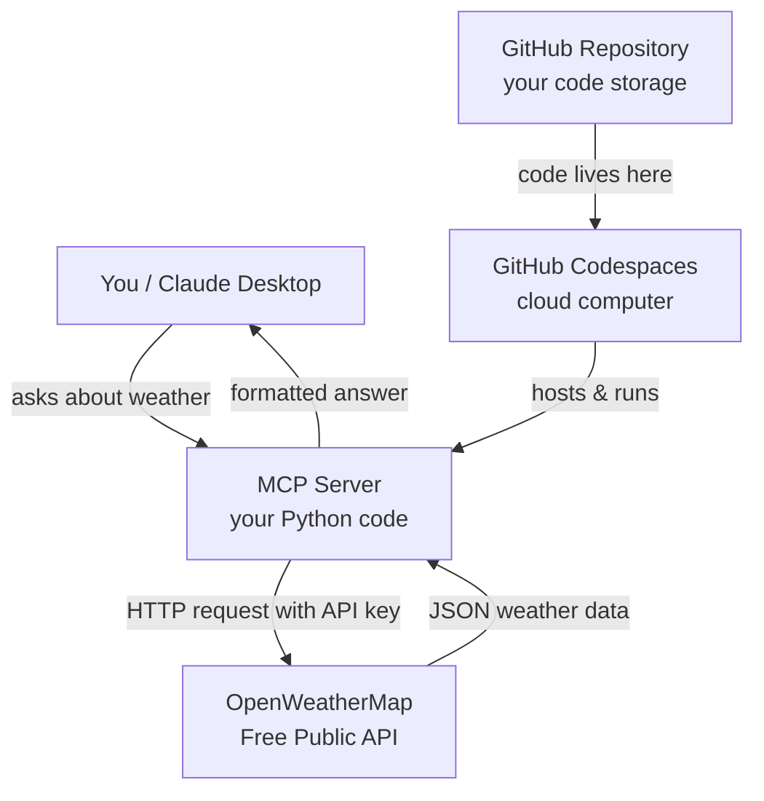
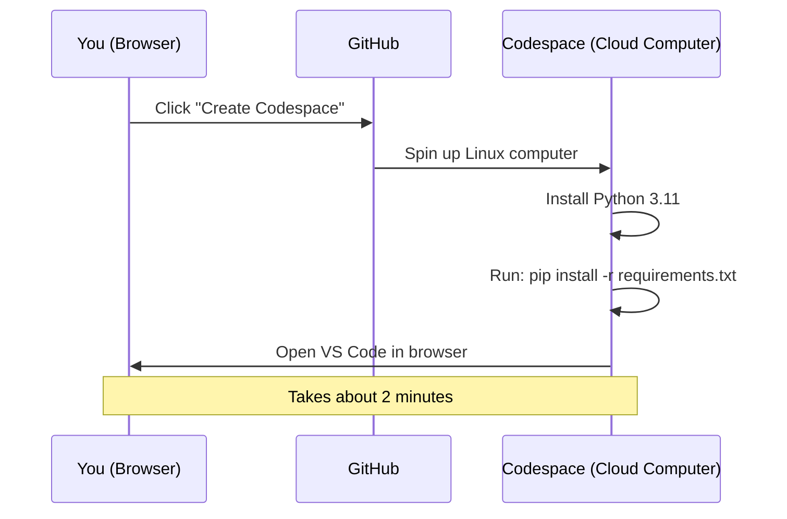
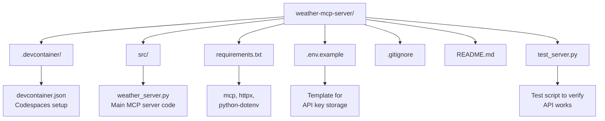
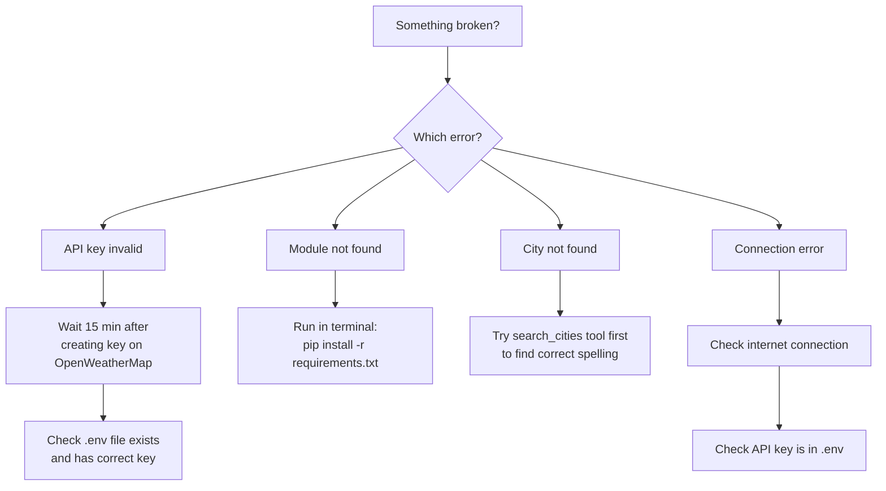
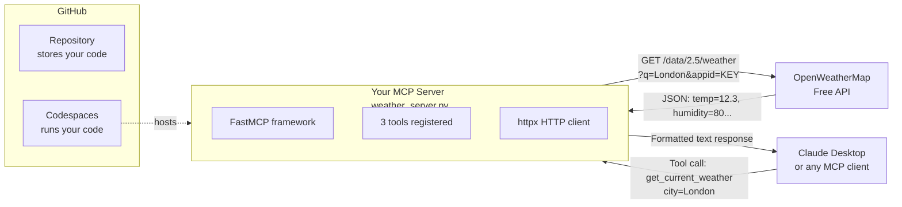

# 🌤️ Weather MCP Server

An MCP (Model Context Protocol) server that wraps the OpenWeatherMap API.
Connect it to Claude Desktop to give Claude real-time weather superpowers!

## 🛠️ Tools Available

| Tool | What it does |
|------|-------------|
| `get_current_weather` | Current temperature, humidity, wind, etc. for any city |
| `get_weather_forecast` | Up to 5-day forecast for any city |
| `search_cities` | Find cities by name (helps with ambiguous names) |

## 🚀 Running on GitHub Codespaces (Recommended)

1. Click the green **Code** button above
2. Click **Codespaces** tab
3. Click **Create codespace on main**
4. Wait for it to load (~2 minutes)
5. In the terminal that opens, create your `.env` file:
   ```bash
   cp .env.example .env


# Detail of the project  


<div class="reasoning-block-marker">

The user wants to create an MCP (Model Context Protocol) server that wraps a public API, and they want to deploy/run it on GitHub. They're a complete beginner with both MCP and GitHub. Let me create a comprehensive step-by-step guide.

Let me think about what to build:
- I'll use the **OpenWeatherMap API** (free tier available, easy to understand)
- Build an MCP server that provides weather data
- Deploy it so it can run via GitHub

Let me plan the complete guide:

1. What is MCP? Brief explanation
2. Set up GitHub account


3. Install required tools (Node.js, Git)
4. Create the project
5. Write the MCP server code
6. Set up GitHub repository
7. Configure and run

For the MCP server, I'm thinking Python with the official MCP SDK would be most straightforward. But actually, when the user says "deploy/run on GitHub," they probably mean using GitHub Codespaces to run it directly in the browser rather than just pushing code to a repository. That's the most beginner-friendly approach.

Let me structure this as a step-by-step guide covering understanding the project, getting an API key, setting up GitHub, creating the project files, pushing to the repo, and running it all in Codespaces. Now I'm writing the actual Python code for the weather MCP server using the mcp package and OpenWeatherMap API.

Writing the server code... Defining the tool handlers... Continuing with the weather forecast endpoint...

Now I'm handling the forecast response and organizing the data by date, then formatting a 5-day summary that groups temperature readings for each day. I need to think about the supporting files like requirements.txt and the devcontainer configuration for GitHub Codespaces. For deployment, GitHub Codespaces seems like the most accessible option for someone just starting out, so I'm planning a structured tutorial that walks through getting an API key, setting up locally, creating a repository, and then running it in the cloud environment.

Now I'm mapping out the project structure and considering the MCP Python SDK imports. Setting up the files and step-by-step instructions...

Actually, I need to reconsider the import approach here. The latest MCP SDK has evolved, so I should use FastMCP which is more straightforward for beginners. I'm writing the weather server code that imports FastMCP and sets up a tool to fetch current weather data from an API, taking city name and temperature units as parameters.

Writing the weather tool implementation... Formatting the weather response... Writing the forecast formatting... Writing the city search function...

Now I'm thinking about how to actually run this MCP server—it typically communicates via stdio for Claude Desktop, but FastMCP also lets me spin it up as an HTTP server for testing. I should create a separate test script that doesn't require Claude Desktop so people can verify it works locally. For the GitHub deployment side, since MCP servers are fundamentally local tools running through stdio, publishing to GitHub really just means storing the code there so others can set it up themselves.

Let me structure a comprehensive beginner-friendly guide that walks through everything: getting the API key, installing dependencies, writing all the code files, setting up a GitHub repo, pushing the code, and then running it through GitHub Codespaces. I'll include diagrams where they help clarify the architecture. Writing test script... Finishing the forecast API test and wrapping up the test suite.

</div>

# Complete Guide: Build & Deploy a Weather MCP Server on GitHub

## What We Are Building



---

## What You Will Have At The End
- A free weather API key
- All project code stored on GitHub
- The server running inside GitHub Codespaces (a computer in the cloud, no install needed on your machine)
- 3 working tools: current weather, 5-day forecast, city search

---

# PART 1 — Get Your Free API Key

> **Why:** The server needs permission to ask OpenWeatherMap for data. The API key is that permission.

### Step 1 — Sign up at OpenWeatherMap

1. Open your browser and go to: **https://openweathermap.org/api**
2. Click the orange button **"Sign In"** in the top right
3. Click **"Create an Account"**
4. Fill in:
   - **Username:** anything you want (e.g. `johnweather`)
   - **Email:** your real email
   - **Password:** something secure
5. Check the two boxes at the bottom (agree to terms)
6. Click **"Create Account"**
7. Check your email → click the confirmation link they send you

### Step 2 — Get Your API Key

1. After confirming email, go back to **https://home.openweathermap.org/api_keys**
2. You will see a table with a key already generated — it looks like: `a1b2c3d4e5f6...` (32 random letters/numbers)
3. **Copy that key and save it somewhere** (Notepad, Notes app) — you will need it later
4. ⚠️ **Wait 10-15 minutes** — new keys take a few minutes to activate

---

# PART 2 — Create a GitHub Account

> **Why:** GitHub is where your code lives. Think of it as Google Drive but for code.

### Step 3 — Sign up at GitHub

1. Go to **https://github.com**
2. Click **"Sign up"** (top right)
3. Enter your email → click **"Continue"**
4. Create a password → click **"Continue"**
5. Enter a username (e.g. `john-dev`) → click **"Continue"**
6. Answer if you want emails → click **"Continue"**
7. Solve the puzzle to prove you're human
8. Click **"Create account"**
9. Check your email → enter the confirmation code GitHub sends you
10. On the welcome survey, you can click **"Skip personalization"** at the bottom

---

# PART 3 — Create Your Repository (Code Storage Folder)

> **Repository = a folder on GitHub that stores your project**

### Step 4 — Create a New Repository

1. After logging into GitHub, click the **"+"** icon in the top-right corner
2. Click **"New repository"**
3. Fill in:
   - **Repository name:** `weather-mcp-server`
   - **Description:** `MCP server that provides weather data`
   - Select **"Public"**
   - ✅ Check **"Add a README file"**
4. Click the green **"Create repository"** button
5. You will be taken to your new repository page at `github.com/YOUR-USERNAME/weather-mcp-server`

---

# PART 4 — Create All The Project Files

> We will create files directly on GitHub using their web editor. No downloading anything yet.

### Step 5 — Create the Main Server File

1. On your repository page, click **"Add file"** → **"Create new file"**
2. In the box that says **"Name your file..."**, type exactly:
   ```
   src/weather_server.py
   ```
   > When you type the `/` it automatically creates a folder called `src`
3. In the big text area below, paste this entire code:

```python
# src/weather_server.py
"""
Weather MCP Server
Wraps the OpenWeatherMap API to give Claude weather superpowers
"""

from mcp.server.fastmcp import FastMCP
import httpx
import os
from dotenv import load_dotenv

# Load environment variables from .env file
load_dotenv()

# Create the MCP server with a name
mcp = FastMCP("Weather Server 🌤️")

# Get API key from environment variable
API_KEY = os.getenv("OPENWEATHER_API_KEY")
BASE_URL = "https://api.openweathermap.org"


# ─────────────────────────────────────────────
# TOOL 1: Get Current Weather
# ─────────────────────────────────────────────

@mcp.tool()
async def get_current_weather(city: str, units: str = "metric") -> str:
    """
    Get the current weather conditions for any city in the world.

    Args:
        city: City name — e.g. "London", "New York", "Tokyo", "Paris"
        units: Temperature unit — "metric" for Celsius, "imperial" for Fahrenheit, "standard" for Kelvin
    """
    if not API_KEY:
        return "❌ ERROR: OPENWEATHER_API_KEY is not set. Check your .env file."

    unit_symbol = "°C" if units == "metric" else "°F" if units == "imperial" else "K"

    async with httpx.AsyncClient() as client:
        response = await client.get(
            f"{BASE_URL}/data/2.5/weather",
            params={
                "q": city,
                "appid": API_KEY,
                "units": units
            },
            timeout=10.0
        )

    # Handle errors from the API
    if response.status_code == 401:
        return "❌ ERROR: Invalid API key. Check your OPENWEATHER_API_KEY."
    if response.status_code == 404:
        return f"❌ ERROR: City '{city}' not found. Try a different spelling."
    if response.status_code != 200:
        return f"❌ ERROR: API returned status {response.status_code}: {response.text}"

    data = response.json()

    # Extract all the useful info
    name        = data["name"]
    country     = data["sys"]["country"]
    temp        = data["main"]["temp"]
    feels_like  = data["main"]["feels_like"]
    temp_min    = data["main"]["temp_min"]
    temp_max    = data["main"]["temp_max"]
    humidity    = data["main"]["humidity"]
    pressure    = data["main"]["pressure"]
    description = data["weather"][0]["description"].title()
    wind_speed  = data["wind"]["speed"]
    wind_deg    = data["wind"].get("deg", "N/A")
    clouds      = data["clouds"]["all"]
    visibility  = data.get("visibility", "N/A")

    return f"""
╔══════════════════════════════════════╗
  🌍  {name}, {country}
╚══════════════════════════════════════╝

🌤️  Condition:    {description}
🌡️  Temperature:  {temp}{unit_symbol}  (feels like {feels_like}{unit_symbol})
📊  Range:        {temp_min}{unit_symbol} → {temp_max}{unit_symbol}
💧  Humidity:     {humidity}%
🌬️  Pressure:     {pressure} hPa
💨  Wind:         {wind_speed} m/s at {wind_deg}°
☁️  Cloud Cover:  {clouds}%
👁️  Visibility:   {visibility} meters
"""


# ─────────────────────────────────────────────
# TOOL 2: Get 5-Day Forecast
# ─────────────────────────────────────────────

@mcp.tool()
async def get_weather_forecast(city: str, days: int = 5, units: str = "metric") -> str:
    """
    Get a multi-day weather forecast for any city.

    Args:
        city: City name — e.g. "Berlin", "Sydney", "Cairo"
        days: How many days of forecast to show (1 to 5)
        units: Temperature unit — "metric" for Celsius, "imperial" for Fahrenheit
    """
    if not API_KEY:
        return "❌ ERROR: OPENWEATHER_API_KEY is not set. Check your .env file."

    # Clamp days between 1 and 5
    days = max(1, min(5, days))
    unit_symbol = "°C" if units == "metric" else "°F" if units == "imperial" else "K"

    async with httpx.AsyncClient() as client:
        response = await client.get(
            f"{BASE_URL}/data/2.5/forecast",
            params={
                "q": city,
                "appid": API_KEY,
                "units": units,
                "cnt": 40  # Maximum data points (covers 5 days)
            },
            timeout=10.0
        )

    if response.status_code == 401:
        return "❌ ERROR: Invalid API key."
    if response.status_code == 404:
        return f"❌ ERROR: City '{city}' not found."
    if response.status_code != 200:
        return f"❌ ERROR: {response.status_code}: {response.text}"

    data = response.json()
    city_name = data["city"]["name"]
    country   = data["city"]["country"]

    # Group forecast data by day
    daily_data = {}
    for item in data["list"]:
        date = item["dt_txt"].split(" ")[0]  # e.g. "2024-12-25"
        if date not in daily_data:
            daily_data[date] = {
                "temps": [],
                "conditions": [],
                "humidity": [],
                "wind": []
            }
        daily_data[date]["temps"].append(item["main"]["temp"])
        daily_data[date]["conditions"].append(item["weather"][0]["description"])
        daily_data[date]["humidity"].append(item["main"]["humidity"])
        daily_data[date]["wind"].append(item["wind"]["speed"])

    result = f"📅 {days}-Day Forecast — {city_name}, {country}\n"
    result += "═" * 45 + "\n\n"

    for date, info in list(daily_data.items())[:days]:
        temps      = info["temps"]
        conditions = info["conditions"]
        humidity   = info["humidity"]
        wind       = info["wind"]

        # Most common weather condition for the day
        most_common = max(set(conditions), key=conditions.count).title()

        result += f"📆  {date}\n"
        result += f"    🌡️  {min(temps):.1f}{unit_symbol} → {max(temps):.1f}{unit_symbol}\n"
        result += f"    🌤️  {most_common}\n"
        result += f"    💧  Humidity: {sum(humidity)/len(humidity):.0f}%\n"
        result += f"    💨  Wind: {sum(wind)/len(wind):.1f} m/s avg\n"
        result += "\n"

    return result


# ─────────────────────────────────────────────
# TOOL 3: Search Cities
# ─────────────────────────────────────────────

@mcp.tool()
async def search_cities(query: str) -> str:
    """
    Search for cities by name. Useful when you need to find the exact
    city name or distinguish between cities with the same name (e.g. "Springfield").

    Args:
        query: City name to search for — e.g. "Springfield", "Manchester", "Alexandria"
    """
    if not API_KEY:
        return "❌ ERROR: OPENWEATHER_API_KEY is not set."

    async with httpx.AsyncClient() as client:
        response = await client.get(
            f"{BASE_URL}/geo/1.0/direct",
            params={
                "q": query,
                "limit": 5,
                "appid": API_KEY
            },
            timeout=10.0
        )

    if response.status_code != 200:
        return f"❌ ERROR: {response.status_code}: {response.text}"

    cities = response.json()

    if not cities:
        return f"🔍 No cities found matching '{query}'. Try a different spelling."

    result = f"🔍 Cities matching '{query}':\n"
    result += "═" * 40 + "\n\n"

    for i, city in enumerate(cities, 1):
        name    = city.get("name", "Unknown")
        country = city.get("country", "??")
        state   = city.get("state", "")
        lat     = city.get("lat", 0)
        lon     = city.get("lon", 0)

        state_str = f", {state}" if state else ""
        result += f"{i}. {name}{state_str}, {country}\n"
        result += f"   📍 Coordinates: {lat:.4f}°N, {lon:.4f}°E\n\n"

    return result


# ─────────────────────────────────────────────
# Run the server
# ─────────────────────────────────────────────

if __name__ == "__main__":
    print("🚀 Starting Weather MCP Server...")
    print("📡 Waiting for connections...")
    mcp.run()
```

4. Scroll down, find the **"Commit new file"** section
5. In the first box (commit message), type: `Add main weather server`
6. Click the green **"Commit new file"** button

---

### Step 6 — Create the Requirements File

> This file tells Python what packages to install

1. On your repository page, click **"Add file"** → **"Create new file"**
2. Name it exactly: `requirements.txt`
3. Paste this content:

```
mcp>=1.0.0
httpx>=0.27.0
python-dotenv>=1.0.0
```

4. Commit message: `Add requirements`
5. Click **"Commit new file"**

---

### Step 7 — Create the Environment Example File

> This shows what environment variables the project needs (without revealing real values)

1. Click **"Add file"** → **"Create new file"**
2. Name it: `.env.example`
3. Paste:

```bash
# Copy this file to a new file called .env
# Then replace the value below with your real API key from openweathermap.org

OPENWEATHER_API_KEY=paste_your_api_key_here
```

4. Commit message: `Add env example`
5. Click **"Commit new file"**

---

### Step 8 — Create the Test Script

> This lets you verify the server works before connecting Claude

1. Click **"Add file"** → **"Create new file"**
2. Name it: `test_server.py`
3. Paste:

```python
# test_server.py
"""
Run this script first to make sure everything is working.
It tests each tool directly without needing Claude Desktop.

How to run:
    python test_server.py
"""

import asyncio
import os
from dotenv import load_dotenv
import httpx

load_dotenv()

API_KEY = os.getenv("OPENWEATHER_API_KEY")
BASE_URL = "https://api.openweathermap.org"


def print_header(title: str):
    print(f"\n{'='*50}")
    print(f"  🧪 {title}")
    print(f"{'='*50}")


async def test_api_key():
    """Test if the API key is valid"""
    print_header("Test 1: Checking API Key")

    if not API_KEY:
        print("❌ FAIL: No API key found!")
        print("   → Make sure you created a .env file")
        print("   → Make sure it contains: OPENWEATHER_API_KEY=your_key_here")
        return False

    print(f"✅ API key found: {API_KEY[:6]}...{API_KEY[-4:]} (hidden for security)")
    return True


async def test_current_weather():
    """Test fetching current weather"""
    print_header("Test 2: Current Weather (London)")

    async with httpx.AsyncClient() as client:
        response = await client.get(
            f"{BASE_URL}/data/2.5/weather",
            params={"q": "London", "appid": API_KEY, "units": "metric"},
            timeout=10.0
        )

    if response.status_code == 401:
        print("❌ FAIL: API key is invalid or not activated yet")
        print("   → Wait 15 minutes after creating your key, then try again")
        return False

    if response.status_code == 200:
        data = response.json()
        temp = data["main"]["temp"]
        desc = data["weather"][0]["description"]
        print(f"✅ SUCCESS!")
        print(f"   London is currently {temp}°C with {desc}")
        return True

    print(f"❌ FAIL: Got status code {response.status_code}")
    print(f"   Response: {response.text}")
    return False


async def test_forecast():
    """Test fetching weather forecast"""
    print_header("Test 3: Weather Forecast (Tokyo)")

    async with httpx.AsyncClient() as client:
        response = await client.get(
            f"{BASE_URL}/data/2.5/forecast",
            params={"q": "Tokyo", "appid": API_KEY, "units": "metric", "cnt": 8},
            timeout=10.0
        )

    if response.status_code == 200:
        data = response.json()
        city = data["city"]["name"]
        count = len(data["list"])
        print(f"✅ SUCCESS!")
        print(f"   Got {count} forecast entries for {city}")
        return True

    print(f"❌ FAIL: Got status code {response.status_code}")
    return False


async def test_city_search():
    """Test city search"""
    print_header("Test 4: City Search (Springfield)")

    async with httpx.AsyncClient() as client:
        response = await client.get(
            f"{BASE_URL}/geo/1.0/direct",
            params={"q": "Springfield", "limit": 3, "appid": API_KEY},
            timeout=10.0
        )

    if response.status_code == 200:
        cities = response.json()
        print(f"✅ SUCCESS!")
        print(f"   Found {len(cities)} cities named 'Springfield':")
        for city in cities:
            state = city.get('state', '')
            state_str = f", {state}" if state else ""
            print(f"   → {city['name']}{state_str}, {city['country']}")
        return True

    print(f"❌ FAIL: Got status code {response.status_code}")
    return False


async def main():
    print("\n🌤️  WEATHER MCP SERVER — TEST SUITE")
    print("=" * 50)

    results = []

    # Run all tests
    results.append(await test_api_key())
    if results[0]:  # Only run API tests if key exists
        results.append(await test_current_weather())
        results.append(await test_forecast())
        results.append(await test_city_search())

    # Summary
    print(f"\n{'='*50}")
    passed = sum(1 for r in results if r)
    total = len(results)

    if passed == total:
        print(f"🎉 ALL {total} TESTS PASSED! Your server is ready.")
    else:
        print(f"⚠️  {passed}/{total} tests passed. Fix the failures above.")

    print("=" * 50)


if __name__ == "__main__":
    asyncio.run(main())
```

4. Commit message: `Add test script`
5. Click **"Commit new file"**

---

### Step 9 — Create the Codespaces Configuration

> This tells GitHub Codespaces how to set up the cloud computer for your project

1. Click **"Add file"** → **"Create new file"**
2. In the name box, type: `.devcontainer/devcontainer.json`
   > Typing the `/` creates the folder automatically
3. Paste:

```json
{
  "name": "Weather MCP Server",
  "image": "mcr.microsoft.com/devcontainers/python:3.11",
  "postCreateCommand": "pip install -r requirements.txt",
  "customizations": {
    "vscode": {
      "extensions": [
        "ms-python.python",
        "ms-python.vscode-pylance",
        "ms-python.debugpy"
      ],
      "settings": {
        "python.defaultInterpreterPath": "/usr/local/bin/python",
        "terminal.integrated.defaultProfile.linux": "bash"
      }
    }
  },
  "forwardPorts": [],
  "remoteEnv": {
    "PYTHONPATH": "${containerWorkspaceFolder}"
  }
}
```

4. Commit message: `Add Codespaces config`
5. Click **"Commit new file"**

---

### Step 10 — Update the README

1. On your repository page, find the file **README.md** and click on it
2. Click the **pencil icon** (Edit this file) in the top right of the file
3. Delete everything there and paste this:

```markdown
# 🌤️ Weather MCP Server

An MCP (Model Context Protocol) server that wraps the OpenWeatherMap API.
Connect it to Claude Desktop to give Claude real-time weather superpowers!

## 🛠️ Tools Available

| Tool | What it does |
|------|-------------|
| `get_current_weather` | Current temperature, humidity, wind, etc. for any city |
| `get_weather_forecast` | Up to 5-day forecast for any city |
| `search_cities` | Find cities by name (helps with ambiguous names) |

## 🚀 Running on GitHub Codespaces (Recommended)

1. Click the green **Code** button above
2. Click **Codespaces** tab
3. Click **Create codespace on main**
4. Wait for it to load (~2 minutes)
5. In the terminal that opens, create your `.env` file:
   ```bash
   cp .env.example .env
   ```
6. Edit the `.env` file and add your API key:
   ```bash
   nano .env
   ```
   Replace `paste_your_api_key_here` with your real key.
   Press `Ctrl+X`, then `Y`, then `Enter` to save.

7. Run the tests:
   ```bash
   python test_server.py
   ```

8. Run the server:
   ```bash
   python src/weather_server.py
   ```

## 🔑 Getting an API Key

1. Go to https://openweathermap.org/api
2. Create a free account
3. Copy your API key from https://home.openweathermap.org/api_keys
4. Note: New keys take ~15 minutes to activate

## 📋 Example Prompts for Claude

Once connected to Claude Desktop:
- *"What's the weather like in Paris right now?"*
- *"Give me a 5-day forecast for New York in Fahrenheit"*
- *"Search for cities named Alexandria"*
- *"Compare weather in Tokyo and London today"*
```

4. Scroll down, commit message: `Update README with instructions`
5. Click **"Commit changes"**

---

# PART 5 — Run on GitHub Codespaces

> **Codespaces = a full computer in the cloud, accessible from your browser. No installs needed.**

### Step 11 — Launch Codespaces

1. Go back to your repository main page (`github.com/YOUR-USERNAME/weather-mcp-server`)
2. Click the green **"< > Code"** button
3. Click the **"Codespaces"** tab
4. Click **"Create codespace on main"**



5. **Wait** — a VS Code editor opens in your browser. This is a real computer running in the cloud.
6. You will see your project files on the left side panel

---

### Step 12 — Add Your API Key

> We can't store the real API key in GitHub (security risk), so we add it directly in Codespaces

1. In the bottom panel, you should see a **Terminal** tab. If not: press `` Ctrl+` `` (backtick key, left of `1`)
2. You will see a prompt like: `@username ➜ /workspaces/weather-mcp-server $`
3. Type this command and press Enter:
   ```bash
   cp .env.example .env
   ```
   > This copies the example file to a real `.env` file

4. Now open the file to edit it. Type:
   ```bash
   nano .env
   ```
5. You will see:
   ```
   OPENWEATHER_API_KEY=paste_your_api_key_here
   ```
6. Use arrow keys to move to `paste_your_api_key_here`, delete it, and type your real API key
7. Save and exit: press **Ctrl+X**, then press **Y**, then press **Enter**
8. Verify it saved by typing:
   ```bash
   cat .env
   ```
   You should see your key there.

---

### Step 13 — Run the Tests

1. In the terminal, type:
   ```bash
   python test_server.py
   ```
2. Press Enter

**What you should see (success):**
```
🌤️  WEATHER MCP SERVER — TEST SUITE
==================================================

==================================================
  🧪 Test 1: Checking API Key
==================================================
✅ API key found: a1b2c3...xyz9 (hidden for security)

==================================================
  🧪 Test 2: Current Weather (London)
==================================================
✅ SUCCESS!
   London is currently 12.3°C with light rain

==================================================
  🧪 Test 3: Weather Forecast (Tokyo)
==================================================
✅ SUCCESS!
   Got 8 forecast entries for Tokyo

==================================================
  🧪 Test 4: City Search (Springfield)
==================================================
✅ SUCCESS!
   Found 3 cities named 'Springfield':
   → Springfield, Missouri, US
   → Springfield, Illinois, US
   → Springfield, Massachusetts, US

==================================================
🎉 ALL 4 TESTS PASSED! Your server is ready.
==================================================
```

**If Test 2 fails with "API key not activated":**
- Wait 15 minutes and try again — new OpenWeatherMap keys need time

---

### Step 14 — Run The MCP Server

1. In the terminal, type:
   ```bash
   python src/weather_server.py
   ```
2. You should see:
   ```
   🚀 Starting Weather MCP Server...
   📡 Waiting for connections...
   ```
3. The server is now running and listening for MCP connections
4. Press **Ctrl+C** to stop it when done

---

# PART 6 — Connect to Claude Desktop (Optional but Fun!)

> This lets you actually use the weather tools by talking to Claude

### Step 15 — Install Claude Desktop

1. Go to **https://claude.ai/download**
2. Download and install for your OS (Windows or Mac)
3. Sign in with your Anthropic account

### Step 16 — Find the Config File Location

**On Mac:**
```
/Users/YOUR_NAME/Library/Application Support/Claude/claude_desktop_config.json
```

**On Windows:**
```
C:\Users\YOUR_NAME\AppData\Roaming\Claude\claude_desktop_config.json
```

### Step 17 — Edit Claude's Config

> This tells Claude Desktop where your MCP server lives

1. Open that config file in any text editor
2. If it's empty or new, paste this entire thing:

```json
{
  "mcpServers": {
    "weather": {
      "command": "python",
      "args": ["/path/to/your/weather_server.py"],
      "env": {
        "OPENWEATHER_API_KEY": "YOUR_ACTUAL_API_KEY_HERE"
      }
    }
  }
}
```

3. Replace `/path/to/your/weather_server.py` with the actual path on your machine
4. Replace `YOUR_ACTUAL_API_KEY_HERE` with your real API key
5. Save the file
6. **Restart** Claude Desktop completely

### Step 18 — Test in Claude

Open Claude Desktop and try these prompts:
- *"What's the weather in Tokyo right now?"*
- *"Give me a 5 day forecast for Sydney in Celsius"*
- *"Search for cities named Alexandria and tell me the weather in the biggest one"*

---

# Complete Project Structure



---

# Troubleshooting



| Error | Fix |
|-------|-----|
| `Module 'mcp' not found` | Run `pip install -r requirements.txt` in terminal |
| `401 Unauthorized` | API key is wrong or not activated yet (wait 15 min) |
| `404 City not found` | Try `search_cities` first to find correct name |
| `.env file not found` | Run `cp .env.example .env` and add your key |
| `Codespace won't start` | Refresh the page and try again |

---

# What You Built — Final Summary



You now have:
- ✅ A real MCP server wrapping a live public API
- ✅ 3 working tools (current weather, forecast, city search)
- ✅ Code stored safely on GitHub
- ✅ Ability to run it in the cloud via Codespaces for free
- ✅ Tests to verify it works
- ✅ Connection instructions for Claude Desktop
